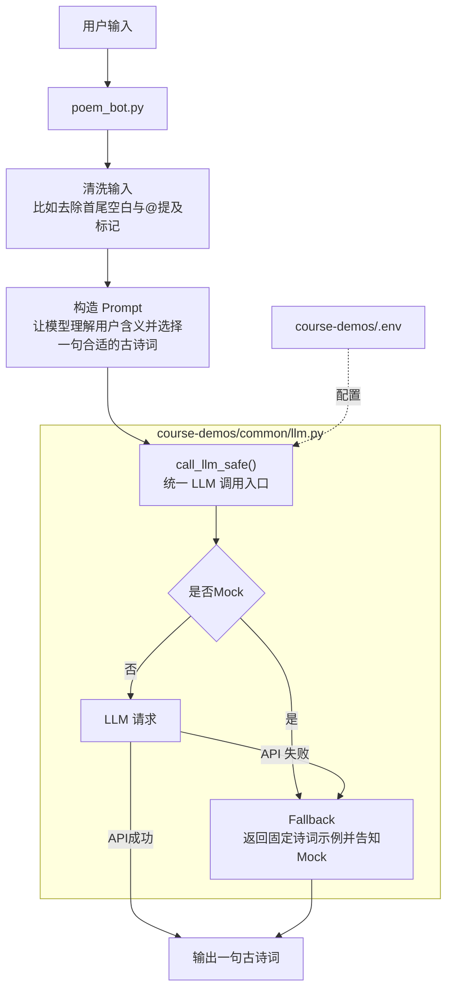

# Session 1：诗词聊天机器人架构设计

## Task1 架构图

```mermaid
flowchart TB
 subgraph shared["course-demos/common/llm.py"]
        llm["call_llm_safe()<br>统一 LLM 调用入口"]
        provider{"是否Mock"}
        real["LLM 请求"]
        mock["Fallback<br>返回固定诗词示例并告知Mock"]
  end
    user["用户输入<br>"] --> entry["poem_bot.py<br>"]
    entry --> clean["清洗输入<br>比如去除首尾空白与@提及标记"]
    clean --> prompt["构造 Prompt<br>让模型理解用户含义并选择一句合适的古诗词"]
    prompt --> llm
    config["course-demos/.env<br>"] -. 配置 .-> llm
    llm --> provider
    provider -- 否 --> real
    provider -- 是 --> mock
    real -- API 失败 --> mock
    real -- API成功 --> reply["输出一句古诗词<br>"]
    mock --> reply
```