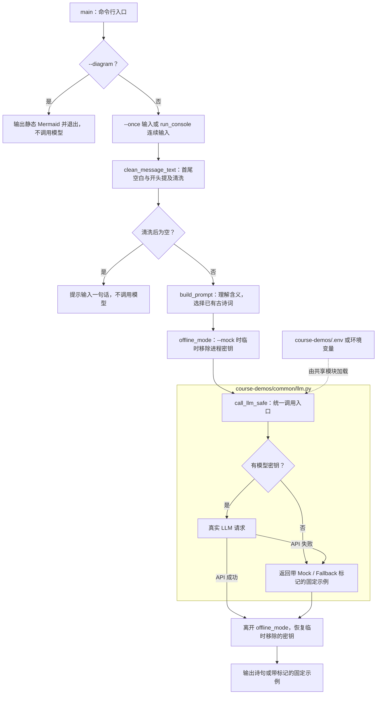

# 诗词机器人：实现架构图

本图来自 poem_bot.py 的 --diagram 输出 (Task 2)。
它是按实现整理的静态 Mermaid 图，不是自动解析源码的结果。

```mermaid
flowchart TB
    start["main：命令行入口"] --> diagram{"--diagram？"}
    diagram -- 是 --> source["输出静态 Mermaid 并退出，不调用模型"]
    diagram -- 否 --> user["--once 输入或 run_console 连续输入"]
    user --> clean["clean_message_text：首尾空白与开头提及清洗"]
    clean --> empty{"清洗后为空？"}
    empty -- 是 --> hint["提示输入一句话，不调用模型"]
    empty -- 否 --> prompt["build_prompt：理解含义，选择已有古诗词"]
    prompt --> offline["offline_mode：--mock 时临时移除进程密钥"]
    offline --> llm
    config["course-demos/.env 或环境变量"] -. 由共享模块加载 .-> llm
    subgraph shared["course-demos/common/llm.py"]
        llm["call_llm_safe：统一调用入口"] --> provider{"有模型密钥？"}
        provider -- 是 --> real["真实 LLM 请求"]
        provider -- 否 --> fallback["返回带 Mock / Fallback 标记的固定示例"]
        real -- API 失败 --> fallback
    end
    real -- API 成功 --> restore["离开 offline_mode，恢复临时移除的密钥"]
    fallback --> restore
    restore --> reply["输出诗句或带标记的固定示例"]
```